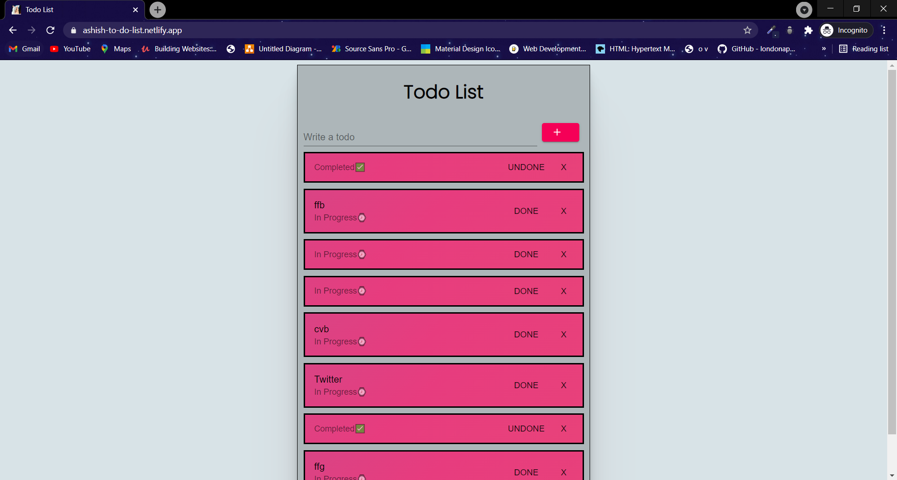

# Todo List
> A todo chat application created using React , Firebase  
> [Live Demo](https://ashish-to-do-list.netlify.app/)

## Table of contents
* [General info](#general-info)
* [Screenshots](#screenshots)
* [Technologies](#technologies)
* [Setup](#setup)
* [Features](#features)
* [Status](#status)

## General info
The project is simple todo application thorugh which user can keep track of tasks to be performed. User can add or remove taks. User can also update the status of the project as in progress or completed. Firebase is used to store the notes. For styling material ui is used. 

## Screenshots

Todo 

## Technologies
* React - version 17.0.2
* material-ui/core - version 4.11.3
* material-ui/icon - version 4.11.2
* Firebase - version 8.5.0 

## Setup

In the project directory, first install all the dependenices run:
## `npm install`

To start the project in the project directory run:
## `npm start`

## Features
List of features ready and TODOs for future development 
* Responsive
* Status updating feature

## Status
Project is : _in progess_
